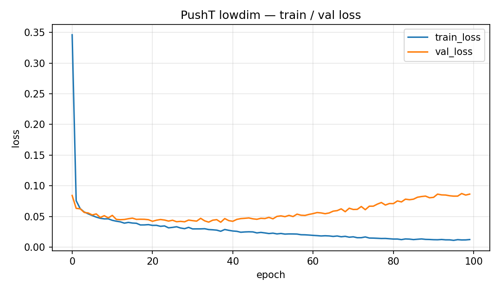
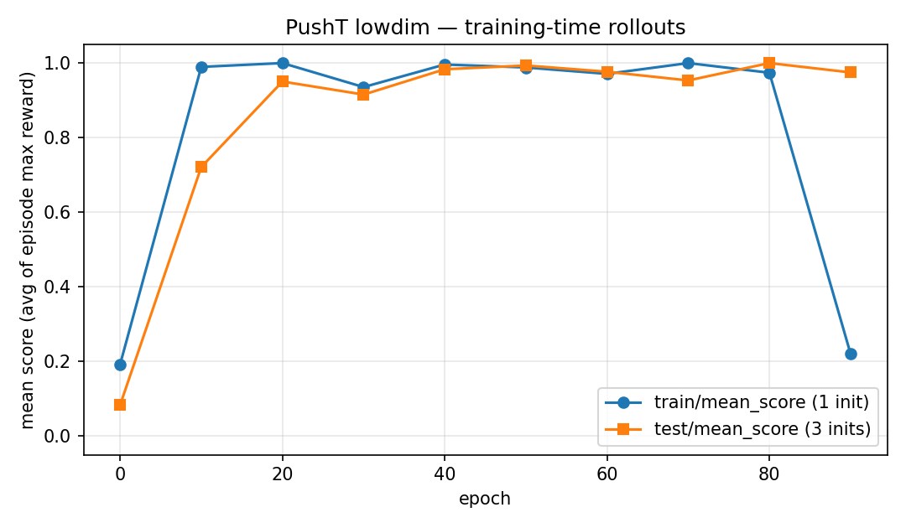

# 04 — Reproduction (PushT lowdim)

Primary training directory: private checkout under `data/outputs/` (identify by checkpoint SHA-256 in [SOURCE_INDEX](results/SOURCE_INDEX.md)).
Reduced logs and eval JSON are copied under [`results/`](results/). **Checkpoint weights are not copied into this note.**

This is a **learning experiment** (100 epochs, small runner panel). It is **not** the paper’s full simulation benchmark.

---

## 1. Environment / task

| Item | Value |
|---|---|
| Task | PushT (keypoints / lowdim) |
| Observation | 20-D keypoints |
| Action | 2-D agent position |
| Max env steps (runner) | 300 |
| Score | mean of episode **max** reward (continuous coverage), not binary success |

This is a different embodiment from Week 1 Transfer Cube (14-D joints, MuJoCo). Numbers are not cross-task comparable.

---

## 2. Dataset

| Item | Value |
|---|---|
| Path | `data/pusht/pusht_cchi_v7_replay.zarr` |
| Source | official PushT training zip from the Diffusion Policy site |
| Representation | **not** the Colab 5-D state demo format |

Checkpoint / normalizer are paired with this 20-D dataset. Do not mix with 5-D Colab weights.

---

## 3. Training config

| Hyperparameter | Value | Notes |
|---|---|---|
| Config name | local Hydra override on official lowdim workspace | inherits UNet widths etc. |
| Policy | `DiffusionUnetLowdimPolicy` |
| UNet dims | `[256, 512, 1024]` | official |
| `horizon` / `n_obs_steps` / `n_action_steps` | 16 / 2 / 8 |
| `num_train_timesteps` | 100 |
| Batch size | 32 | train + val |
| DataLoader workers | 0 |
| `n_envs` | 1 | AsyncVectorEnv still uses one worker |
| Rollout panel while training | 1 train + 3 test inits | every 10 epochs |
| EMA | True |
| LR | AdamW `1e-4` (official) |
| Epochs | 100 |
| Seed | 42 |
| W&B | disabled | package still imported |
| Checkpointing | `latest` every epoch; top-k **off** | latest ≠ best |

### Software / hardware

| Item | Value |
|---|---|
| OS | Windows 10 (build 26200) |
| GPU | NVIDIA GeForce RTX 4060 Laptop GPU |
| PyTorch | 2.1.2+cu121 |
| diffusers | 0.11.1 |
| Python | 3.9 |
| Git commit (ablation manifest) | `5ba07ac6661db573af695b419a7947ecb704690f` |

---

## 4. Training curves

Source: [`results/epoch_metrics.csv`](results/epoch_metrics.csv) (one row per epoch from `logs.json.txt`).

| Epoch | train_loss | val_loss | test/mean_score (if logged) |
|---:|---:|---:|---:|
| 0 | 0.346 | 0.084 | 0.083 |
| 1 | 0.076 | 0.063 | — |
| 9 | 0.046 | 0.048 | — |
| 50 | 0.022 | 0.049 | 0.994 |
| 90 | 0.012 | 0.081 | 0.975 |
| 99 | 0.012 | 0.087 | (no rollout this epoch) |





**Notes for interpretation**

- Train loss falls through epoch 99; **val loss rises** after the mid run (epoch 99 val ≈ 0.087 vs ~0.048 near epoch 9).
- Epoch 90 training-time **train** rollout mean score dropped to **0.220** while **test** stayed **0.975** — small panels are noisy.
- Saved file is **`latest.ckpt`**, not a score-selected best checkpoint.

---

## 5. New-process evaluation

Command pattern (local checkout):

```text
python eval.py --checkpoint <run>/checkpoints/latest.ckpt --output_dir <run>/final_eval --device cuda:0
```

Result: [`results/final_eval.json`](results/final_eval.json)

| Metric | Value |
|---|---|
| `test/mean_score` (3 inits: 100000–100002) | **1.0** |
| `train/mean_score` (1 init) | **0.980** |

This reuses the runner settings stored in the checkpoint (learning-scale panel). It is a **reload consistency** check, not an expanded independent test set.

---

## 6. Checkpoint identity (reference only)

| Field | Value |
|---|---|
| Relative path | private checkout under `data/outputs/…/checkpoints/latest.ckpt` |
| SHA-256 | `922e11a246a4484e7d59956b9fa36da88cbfdf8d2406c937f92357b2cd09001d` |
| Loaded key | `ema_model` |
| Saved counters | epoch **99**, global_step **33599** |
| Approx. size | ~1.0 GB — **not uploaded** |

See [SOURCE_INDEX](results/SOURCE_INDEX.md).

---

## 7. Not tested this week

- Official full-length / multi-seed paper PushT protocol
- Image or hybrid Diffusion Policy
- Retraining with different `num_train_timesteps`
- Real robot
- Head-to-head ACT vs Diffusion on one shared task
