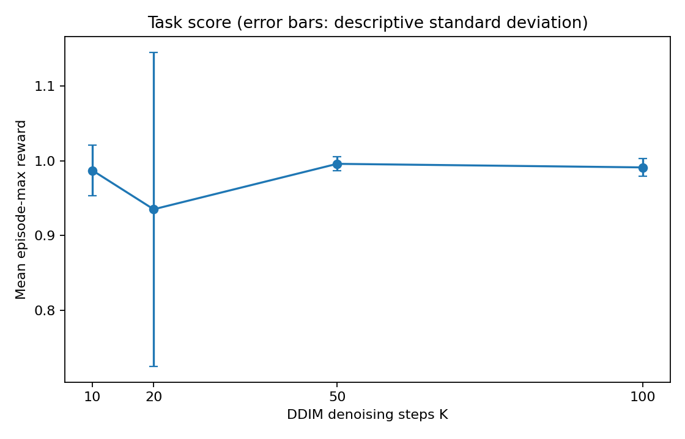
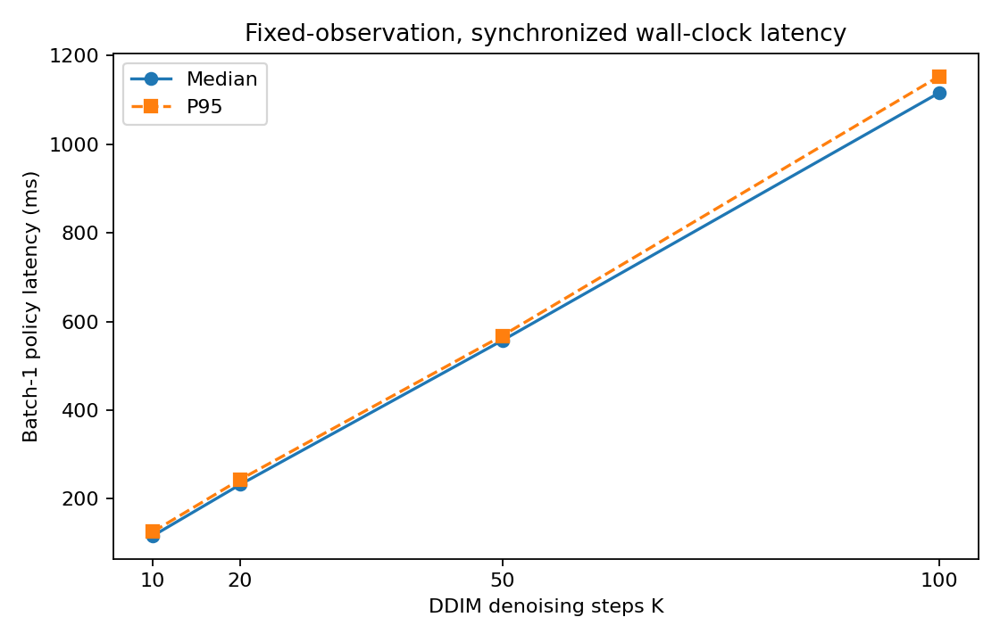
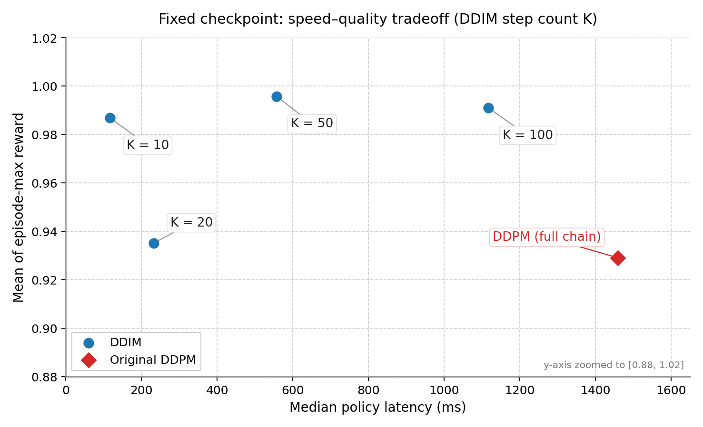

# 06 — Inference Step Ablation

Controlled study on **one** self-trained EMA checkpoint: how DDIM inference step count $K$ trades latency for PushT mean score.  
Main numbers: [`results/summary.csv`](results/summary.csv), [`results/manifest.json`](results/manifest.json).  
Chinese table/conclusion copies: [`results/comparison_table.md`](results/comparison_table.md), [`results/CONCLUSION_zh.md`](results/CONCLUSION_zh.md).

---

## 1. Experiment identity

| Field | Value |
|---|---|
| Checkpoint | self-trained PushT lowdim `latest.ckpt` (local) |
| SHA-256 | `922e11a246a4484e7d59956b9fa36da88cbfdf8d2406c937f92357b2cd09001d` |
| Origin | self-trained (user-declared) |
| Weights | `ema_model` |
| Policy | `DiffusionUnetLowdimPolicy` |
| Obs / act | 20 / 2 |
| $T_p$ / $T_o$ / $T_a$ | 16 / 2 / 8 |
| Training $N$ | 100 |
| GPU | RTX 4060 Laptop, `cuda:0` |
| torch / diffusers | 2.1.2+cu121 / 0.11.1 |
| Env seeds | 100000–100004 |
| Sampling seeds | 0, 1, 2 |
| Max env steps | 300 |
| Status | `complete` ([`manifest.json`](results/manifest.json)) |

---

## 2. Hypothesis and controls

**Hypothesis:** fewer DDIM steps reduce `predict_action` latency; effect on task score must be measured.

**Held fixed:** checkpoint, EMA weights, normalizer, windows, trained $\beta$ schedule, DDIM $\eta{=}0$, `steps_offset=0`, `set_alpha_to_one=True`, `use_clipped_model_output=False`, leading spacing, env panel, seeds, fp precision, timing definition.

**Independent variable:** DDIM $K \in \{100,50,20,10\}$ ($K$ divides $N$).

**Separate reference:** full-chain native **DDPM** (not entered into DDIM speedup ratios). Do not attribute DDPM→DDIM-10 entirely to “smaller $K$.”

Leading timesteps (from ablation notes):

| $K$ | First levels (leading) |
|---|---|
| 100 | 99, 98, …, 0 |
| 50 | 98, 96, …, 0 |
| 20 | 95, 90, …, 0 |
| 10 | 90, 80, …, 0 |

---

## 3. Timing definition

- Object: batch-1 full `predict_action` (normalize, $K$ network/sampler updates, unnormalize, action slice).
- Observation is fixed and GPU-resident (`fixed_observation` used only for timing; not uploaded).
- `torch.cuda.synchronize` brackets `perf_counter`.
- Default: 3 warmups, 20 measured calls; report median and empirical P95.
- **Excluded:** model load, H2D/D2H, env physics, video encode.

Speedup = median latency of DDIM-100 divided by median latency of the current DDIM $K$.

Same-day seed-0-only side run ([`ablation_seed0_summary.csv`](results/ablation_seed0_summary.csv)) had DDIM-100 median **1411 ms** vs main-table **1116 ms** — latency depends on GPU state that day. Do not treat either as a deployment SLA.

---

## 4. Main results (5 envs × 3 sampling seeds)

| Sampler | $K$ | $n$ | mean score | desc. std | median ms | P95 ms | vs DDIM-100 |
|---|---:|---:|---:|---:|---:|---:|---:|
| DDPM (ref.) | 100 | 15 | 0.929 | 0.209 | 1458.7 | 1487.3 | — |
| DDIM | 100 | 15 | 0.991 | 0.012 | 1116.1 | 1153.3 | 1.00× |
| DDIM | 50 | 15 | 0.996 | 0.010 | 557.1 | 567.9 | 2.00× |
| DDIM | 20 | 15 | 0.935 | 0.210 | 231.9 | 243.4 | 4.81× |
| DDIM | 10 | 15 | 0.987 | 0.034 | 116.2 | 125.3 | 9.60× |

Paired score deltas vs DDIM-100: +0.005 (K=50), −0.056 (K=20), −0.004 (K=10).

---

## 5. Takeaways

1. Latency scales roughly with $K$ under this DDIM setup (≈2× / 4.8× / 9.6× for 50 / 20 / 10).
2. Mean score does **not** fall monotonically with $K$ on this panel; K=20 is hurt mainly by one episode (env 100003 / noise 0 → 0.179). See [05_Behavior_Case.md](05_Behavior_Case.md).
3. **Candidate tradeoff for this checkpoint and panel:** $K{=}10$ (116.2 ms median, ≈9.60×, paired Δscore −0.004). **Not** a universal optimum.
4. Offline diffusion training with $N{=}100$ still allows cheaper DDIM inference without retraining.
5. Sync simulation **does not** model real-time compute delay; faster `predict_action` ≠ proven real-robot stability.

---

## 6. Limits

- 5 environment initial conditions; sampling seeds are not independent environments.
- Descriptive std ≠ confidence interval; mean score ≠ success rate.
- Power mode during timing was not logged.
- Side study (`ablation_seed0_*`) is **not** the primary table.

---

## 7. Concept checks

1. Why can $K$ change without retraining? Same trained $\beta$ / network; DDIM reuses them with a different timestep schedule.
2. Why is changing `num_train_timesteps` a different experiment? That alters the **trained** noise schedule and usually needs a new model.
3. Why not `break` early inside a 100-step loop to fake $K{=}10$? Leading schedules change which noise levels are visited, including the start index.
4. Why not fold DDPM-100 vs DDIM-10 into “effect of $K$”? Sampler family also changed.
5. Why CUDA synchronize for timing? Asynchronous GPU kernels otherwise make `perf_counter` intervals incomplete.
6. Why is mean score 0.9 not “90% success”? It averages continuous max rewards, not binary successes.
